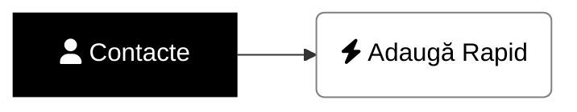
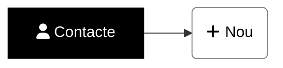

### <i class='fas fa-user'></i> Cum adaug manual un nou contact - modul rapid?

> Vezi şi ce capcane pot apare când adaugi manual contacte[^notasubsol].
{: .prompt-warning }

[//]: # (Comming soon video)


📺 [Vezi Video](https://www.youtube.com/watch?v=LMlCN6_vUvs)

### <i class='fas fa-user'></i> Cum adaug manual un nou contact?

> Vezi şi ce capcane pot apare când adaugi manual contacte[^notasubsol].
{: .prompt-warning }

[//]: # (Comming soon video)


📺 [Vezi Video](https://www.youtube.com/watch?v=LMlCN6_vUvs)

### Note de subsol

[^notasubsol]: [vezi aici]()
