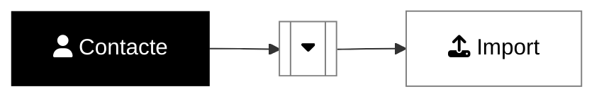
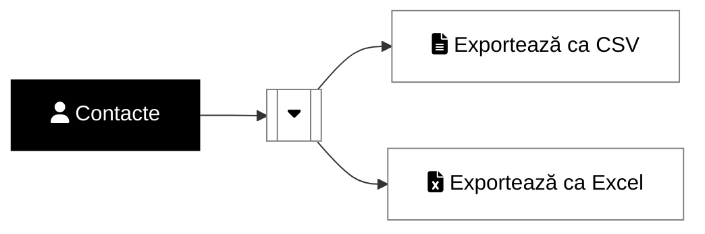

### <i class='fas fa-user'></i> Cum import contacte?
> Necesare:
> * un fişier .csv cu contactele
> * un segment deja creat, dacă doreşti să adaugi contactele într-un segment
{: .prompt-info }

[//]: # (Comming soon video)


📺 [Vezi Video](https://www.youtube.com/watch?v=LMlCN6_vUvs)

### <i class='fas fa-user'></i> Cum export contacte?

[//]: # (Comming soon video)


📺 [Vezi Video](https://www.youtube.com/watch?v=LMlCN6_vUvs)
